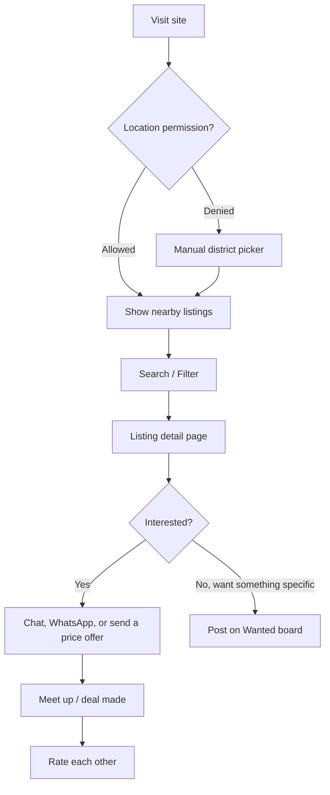
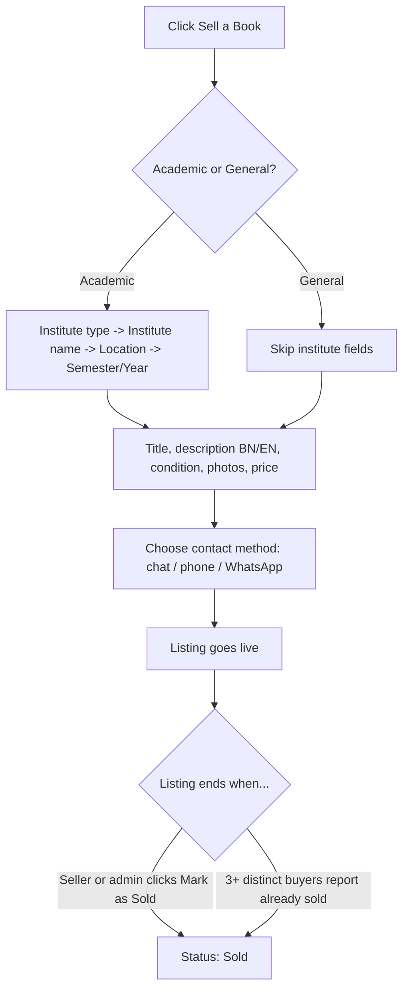

# Boi Lagbe (বই লাগবে) — Campus Used-Book Marketplace
### Full Product & Build Plan (v1.1)

> Site name confirmed: **Boi Lagbe** / বই লাগবে ("Need a Book").

The entire website must support both **Bangla and English**, allowing users to switch between the two languages seamlessly.

**Bangla should be the primary language** throughout the platform. Every Bangla word, phrase, button label, message, notification, and UI element must be carefully written to sound **natural, polished, user-friendly, and native**, rather than feeling machine-translated or system-generated.

The Bangla localization should receive **special priority and attention to detail**, ensuring that the overall experience feels like the website was originally designed for Bangla-speaking users. English should also be fully supported as an alternative language.


## Changelog — What's New in This Round

- **Site name confirmed:** বই লাগবে / *Boi Lagbe*.
- **Architecture switched** to the stack you specified — Next.js + TypeScript, Python + FastAPI, PostgreSQL, Cloudflare R2, all deployed via Vercel + GitHub. See §5 and §6 for the free-tier specifics and one adjustment needed for chat.
- **Added:** a public "Last Price" offer feed — buyers can send a price offer through chat, and it shows publicly on the listing page (§3.5).
- **Added:** crowd-sourced auto-mark-as-sold — when 3 different buyers flag a listing as already sold, it's automatically removed from active listings (§3.6).
- **Removed:** time-based auto-expiry — you said it's not needed, so listings now stay live until marked sold, manually or automatically.
- **Simplified:** MVP sign-up is just an email or a phone number name and password, no OTP for now — see §3.1 for one security trade-off worth knowing about before you launch this way.

---

## 0. What This Document Is

You described the idea in Bangla and had GPT expand it first. I read that version, kept what's genuinely good about it, cut what was vague, and added the pieces that weren't specified yet — a real tech stack, a database design, a concrete free-hosting plan, and a phased build order. You then sent a second round of notes (auth approach, admin controls, the price-offer idea) plus a specific architecture, and this version folds all of that in. This file is meant to be handed to a developer — or an AI coding tool like Claude Code — and built from directly.

**What's been kept from the original idea throughout both rounds:**
- Two-track listing flow: Academic books (institute → location → semester/class tagging) vs. General books (no institute needed).
- Location-first browsing — detect the user's location on landing, show nearby books by default.
- Bilingual (Bangla + English) descriptions.
- Institute name autosuggest instead of free typing.
- "Search must be forgiving" — because students write messy, incomplete descriptions, so keyword search alone will fail.

**What I've added across both rounds:**
- A concrete tech stack and a real, numbers-based answer for free hosting (§5, §6).
- In-app chat as the default contact method instead of a public phone number.
- A "Wanted" board, ratings, reporting, and a moderation path.
- A concrete database schema and a concrete search implementation (§7, §8).
- This round: the public price-offer feed, crowd-sourced sold-detection, and a clear-eyed note on the auth trade-off you've chosen.

---

## 1. The Problem, Restated

Students at colleges, polytechnics, technical institutes , and schools buy semester-specific textbooks that become useless the moment the semester ends. Right now those books either get resold informally (word of mouth, Facebook groups, physical shops that lowball them) or just sit unused. There's no place organized around *how students actually search* — by institute, semester/year, and location — with search that tolerates the fact that most listings will be typed carelessly by 18–22 year-olds in a hurry.

## 2. Who This Is For

| Role | Who | What they need |
|---|---|---|
| Seller | Any student with used books | List fast, reach nearby buyers from the same institute, not get scammed |
| Buyer | Any student needing books | Find the *exact* semester/edition cheaply, near them, without wading through spam |
| Admin (you) | Platform owner | Keep institute list clean, moderate bad listings, see basic growth stats |

---

## 3. Feature Set

### 3.1 Authentication (Sign-up & Login)

- **Sign-up fields: name, email, password.** No OTP needed — the password is what makes this safe without requiring an email-sending or SMS service.
- Password is hashed with bcrypt in FastAPI (never stored in plain text), login issues a JWT session token.
- Phone number still exists on the user's profile (optional) — it's used for the "reveal phone number to interested buyers" contact option on a listing (§3.2, Step 4), not for logging in.

### 3.2 Listing Flow (Seller Side)

**Step 1 — Choose category:**
- 📚 Academic Book (needs institute info)
- 📖 General / Story Book (skips institute info)
- 📝 *(New)* Notes / Previous-Year Suggestions / Question Bank — extremely common in Bangladesh (exam "সাজেশন" culture), and functionally different from a textbook, so it deserves its own tag rather than being forced into "Academic Book."

**Step 2 (Academic only) — Institute details:**
1. Select type: School / College / Polytechnic / University / Madrasah / Coaching Center
2. Select or search institute name (autosuggest from a pre-seeded + community-added list — see §7)
   - If not found: "+ Add new institute" → goes to a pending-approval queue instead of instantly polluting the list
3. Select location (auto-filled from device GPS, editable; falls back to a manual Division → District dropdown if the user denies location permission — Bangladesh has 8 divisions / 64 districts, cheap to hardcode)
4. Select level: Semester (1st–8th for polytechnic), Year (1st/2nd/3rd/4th for college/university), or Class (for school)

**Step 3 — Book details:**
- Title, Author/Publisher (optional)
- Description — **both** a Bangla field and an English field, either one optional but at least one required
- Condition: New / Like New / Good / Fair (photo required, at least 1, up to 6)
- Price (৳) — optional "or negotiable" toggle
- Quantity (some students sell a full semester bundle, not one book)

**Step 4 — Contact preference:**
- In-app chat (default, recommended)
- Reveal phone number to interested buyers only (opt-in, not shown publicly by default — a public phone number on every listing is a spam/harassment magnet)
- WhatsApp quick-chat link (`wa.me/...`) — zero backend cost, many BD students prefer this over calling

Once a listing is live, see §3.5 for how buyers can send price offers on it, and §3.6 for how it eventually gets marked sold.

### 3.3 Discovery Flow (Buyer Side)

1. On landing, request browser location permission → show nearby listings by default, sorted by distance. If denied, fall back to a manual location dropdown (never leave the buyer stuck).
2. Prominent search bar with **typo-tolerant, partial-match search** (see §8 — this is the feature that makes or breaks the "students write bad descriptions" problem the original idea correctly identified).
3. Filter chips below search: Institute type, Semester/Year/Class, Category (Academic / General / Notes), Price range, Condition.
4. Listing card shows: cover photo, title, price, condition, distance ("1.2 km away"), institute name.
5. Listing detail page: full description (Bangla/English), photos, seller's rating (§3.7), recent price offers (§3.5), "Chat" and "Call/WhatsApp" buttons.

### 3.4 "Wanted" Board
A buyer can post "Looking for [Book Name], [Institute], [Semester]" and get notified when a matching listing appears. This solves the cold-start problem — early on you'll have more buyers than sellers, and this gives buyers a reason to come back instead of bouncing off an empty search.

### 3.5 Public Price Offers ("Last Price")

A feature you asked for that isn't common on typical classifieds sites, closer to how open bazaars actually work: when a buyer sends a price offer to a seller through chat, they tag it specifically as an **offer** (a small "Offer a price" action inside the chat, not just typing "500" as plain text, so the system knows which number is a real offer). That offer then shows up publicly on the listing page as a running feed, e.g.:

> **Recent offers:** ৳500 · 2h ago — ৳450 · 1d ago — ৳480 · 2d ago

This gives every visitor a sense of what the book is actually trading for, not just the asking price — which mirrors how bargaining already works at physical book bazaars, just made visible to everyone instead of staying inside one conversation.

A couple of implementation defaults I picked (flagged again in §11 in case you want them different):
- **Offers are shown anonymized** — just the price and how long ago, not the buyer's name — so buyers are comfortable making an offer without it being publicly tied to their identity. The seller can still see who sent it, since it's inside their own private chat.
- **One active offer per buyer per listing** — a new offer updates their existing one rather than stacking duplicates, so the feed can't be spammed by one person to make a book look more in-demand than it is.
- Offers are **non-binding** — this is a transparency feature, not an auction. The seller still finalizes any deal through chat/meetup as normal.

### 3.6 Marking a Listing as Sold

Two ways a listing gets marked sold — this replaces the earlier auto-expiry idea, per your note that a time limit isn't needed:

1. **Manually**, by the seller (or by you, from the admin dashboard) — a "Mark as Sold" button, available any time.
2. **Crowd-sourced auto-detection.** If **3 different buyers** (distinct accounts, not one person repeatedly) use the "Already sold" report reason on a listing, it automatically flips to Sold and drops out of active search results — no admin has to step in for the common case. The admin dashboard still surfaces these for a quick sanity check in case of a bad-faith pile-on, but the system doesn't wait on review to act.

### 3.7 Trust & Safety
- **Ratings:** after a chat thread is marked "deal done," both sides can leave a 1–5 star rating + short comment.
- **Reporting:** "Report this listing/user" → goes to a lightweight admin queue, and — for the "already sold" reason specifically — also powers the auto-mark-as-sold in §3.6.
- **Institute verification (light-touch, not KYC):** don't over-engineer this at MVP stage — most polytechnics won't give students official email addresses, so ID verification isn't realistic yet. Trust starts with ratings + reports, not documents.
- **Safety tips page:** meet in public campus areas, daylight, don't pay in full before seeing the book — standard classifieds-safety copy, costs nothing, matters a lot for an in-person-exchange marketplace.

### 3.8 Growth Features (Phase 2+, not MVP)
- SEO landing pages per institute + district (e.g. `/dhaka/dhaka-polytechnic-institute`) so Google indexes "used books [institute name]" searches — free organic traffic.
- Installable PWA (Progressive Web App) with push notifications for new messages — gives an app-like experience with zero app-store cost or review process.
- Campus ambassador / referral program for organic growth once you have 1–2 seed institutes live.

---

## 4. User Flow (High Level)





---

## 5. Recommended Tech Stack

This is your specified architecture, confirmed and filled in with the free-tier specifics:

| Layer | Choice | Why |
|---|---|---|
| Frontend | **Next.js + TypeScript**, hosted on **Vercel** | SSR/SSG for good Google indexing (important for your SEO institute pages), huge ecosystem, first-class free hosting |
| Backend / API | **Python + FastAPI**, hosted on **Vercel** | Vercel officially supports FastAPI with a zero-config Python runtime as of 2026 — same GitHub repo, same deploy pipeline as the frontend. Handles auth, listings, search, filtering, messaging — all business logic. |
| Database | **PostgreSQL on Neon** (serverless Postgres) | Real Postgres, exactly what you specified. Supports both **PostGIS** (distance/geolocation queries) and **pg_trgm** (typo-tolerant search) — the same extensions the search plan in §8 needs. Free tier suspends when idle but wakes itself back up on the next query, with no manual dashboard step required. |
| File / image storage | **Cloudflare R2** | 10 GB free storage and, importantly, **zero egress fees** — matters once book photos generate real traffic. FastAPI issues a short-lived presigned upload URL, and the browser uploads the photo *directly* to R2, so image bytes never pass through the Vercel function — this sidesteps Vercel's function size/time limits entirely. |
| Auth | Custom, built in FastAPI | Email+name or phone number creates an account — see §3.1 for exactly what that means and one thing worth knowing about it. |
| Real-time chat | **Polling, not WebSockets** | See the callout just below — a deliberate adjustment to fit Vercel's hosting model. |
| Location detection | Browser Geolocation API | Free, built into every browser, no API key |
| Reverse geocoding | OpenStreetMap Nominatim | Free at low request volume |
| Deployment | GitHub → Vercel, automatic | Push to `main`; Vercel builds and deploys both the Next.js frontend and the FastAPI backend automatically |

**One adjustment to flag, and why:** Vercel's free Python runtime runs FastAPI as *stateless serverless functions* — each request spins up, runs, and shuts down; there's no persistent server process to hold a WebSocket connection open, and free-tier functions time out after 10 seconds. That's completely fine for a REST API (list books, create a listing, search) but it means true WebSocket-based chat won't work reliably here. The practical, zero-cost fix: the chat window polls a `GET /messages?after=<timestamp>` endpoint every 3–4 seconds while it's open. It's not sub-second real-time, but for a classifieds chat ("is this still available?") a few seconds of latency is genuinely unnoticeable, and it fits Vercel's model perfectly. If you ever want true real-time later, only the chat piece would need to move — everything else stays exactly as it is.

**Flow, confirmed:**
```
Next.js  ->  FastAPI  ->  PostgreSQL (Neon)
FastAPI  ->  Cloudflare R2  (presigned upload/download URLs for images)
GitHub   ->  Vercel  (automatic deploy on push, for both frontend and backend)
```

---

## 6. Free Hosting — the Actual Numbers (checked August 2026)

Free tiers change, so treat this as "true today, worth re-checking before you scale," not a permanent guarantee.

| Service | Free tier gives you | The catch to know about |
|---|---|---|
| **Vercel (Hobby)** | 100 GB bandwidth/month, ~1M function invocations, unlimited static hosting, free `.vercel.app` subdomain + your own custom domain, automatic GitHub deploys | Two things: (1) Python functions get a **10-second execution timeout** on the free tier — fine for normal API calls, just don't do anything heavy (like image processing) inside a request. (2) Hobby is officially for **non-commercial personal projects**; a classifieds site with no on-platform checkout is fine at MVP stage, but revisit this once you add paid features (see §10, Phase 3). |
| **Neon (PostgreSQL)** | 0.5 GB storage, 100 compute-hours/month, autoscaling up to 2 CU, scale-to-zero after ~5 minutes idle | Scale-to-zero means the *first* query after a quiet period has a small cold-start delay (a few hundred milliseconds) while it wakes up — noticeable but not a real problem for a browsing site. Since photos live in R2 rather than the database, 0.5 GB of text/relational data goes a long way. |
| **Cloudflare R2** | 10 GB storage, 1M writes/month, 10M reads/month, **zero egress fees, even beyond the free tier** | Storage-only, no database attached — which is exactly the role it plays here, alongside Neon |

**Bottom line:** Vercel (frontend + backend) + Neon (database) + Cloudflare R2 (images) — all free, and this is exactly the architecture you specified. Nothing here needs a credit card to start.

**On domains:** don't use "free" TLDs like `.tk`/`.ml` — they're commonly flagged as spam by browsers and email providers, which will hurt trust for a marketplace where trust is everything. Launch on the free `your-project.vercel.app` subdomain, and budget for a real `.com` or `.com.bd` domain (a few dollars a year) once you're ready to promote it publicly — that's the one cost worth paying even in a "free-only" plan.

---

## 7. Database Schema (PostgreSQL / Neon)

```
institutes
  id, name, type (school|college|polytechnic|university|coaching),
  district, division, lat, lng, verified (bool), created_by, created_at

categories
  id, slug, name_bn, name_en, needs_institute (bool)
  -- seed rows: academic_book, general_book, notes_suggestion

users
  id, name, email (required, unique), password_hash (required, bcrypt),
  phone (nullable, unique -- used only for contact-reveal on listings, not login),
  avatar_url, institute_id (nullable), rating_avg, rating_count, created_at

listings
  id, seller_id, category_id, institute_id (nullable),
  title, description_bn, description_en,
  condition (new|like_new|good|fair),
  level_label (e.g. "4th Semester" / "HSC 1st Year"),
  price, quantity, status (active|sold),
  lat, lng, search_vector (tsvector, generated),
  view_count, created_at

listing_images
  id, listing_id, r2_key, sort_order

conversations
  id, listing_id, buyer_id, seller_id, created_at

messages
  id, conversation_id, sender_id, content, created_at, read_at

price_offers
  id, listing_id, buyer_id, offered_price, created_at
  -- one active row per (listing_id, buyer_id); a new offer updates it, not stacks
  -- shown publicly on the listing page as an anonymized feed: "৳450 · 2h ago"

wanted_posts
  id, user_id, title, institute_id (nullable), level_label,
  description, created_at, fulfilled (bool)

favorites
  user_id, listing_id

reviews
  id, reviewed_user_id, reviewer_id, listing_id, rating, comment, created_at

reports
  id, target_type (listing|user), target_id, reporter_id,
  reason (already_sold|spam|scam|inappropriate|other),
  status (open|reviewed|dismissed), created_at
  -- when a listing collects reports with reason = already_sold from
  -- 3 distinct reporters, a background check auto-sets listings.status = 'sold'
```

---

## 8. Making Search Actually "Advanced"

This was the most important gap in the original idea — it *asked* for forgiving search but didn't say how. Here's how, concretely, using only free Postgres extensions, called from FastAPI via SQLAlchemy or plain `asyncpg` (the SQL itself is identical either way):

1. Enable two extensions in Neon's SQL editor (or any Postgres client), one-time and free:
   ```sql
   create extension if not exists pg_trgm;
   create extension if not exists postgis;
   ```
2. Add a generated full-text search column on `listings`, using the `simple` text search config (not `english`) because `simple` doesn't try to stem words — important since descriptions mix Bangla and English and English stemming rules don't apply to Bangla:
   ```sql
   alter table listings add column search_vector tsvector
     generated always as (
       to_tsvector('simple', coalesce(title,'') || ' ' || coalesce(description_bn,'') || ' ' || coalesce(description_en,''))
     ) stored;
   create index listings_search_idx on listings using gin(search_vector);
   create index listings_trgm_idx on listings using gin (title gin_trgm_ops);
   ```
3. At query time, combine **full-text match** (handles whole-word search well) with **trigram similarity** (handles typos, partial words, and "close enough" matches — e.g. searching "polytecnic" still finds "polytechnic" listings). Rank results by a blend of both scores, and boost exact institute/semester filter matches to the top.
4. For location, sort/filter by real distance instead of "same district only":
   ```sql
   select *, ST_Distance(geography(point(lng,lat)), geography(point($user_lng,$user_lat))) as distance_m
   from listings
   order by distance_m asc;
   ```

This gives you genuinely good search on a $0 budget — no need for a paid service like Algolia or Elasticsearch.

---

## 9. Design & UX Direction

- **Mobile-first.** The overwhelming majority of your users will browse on a phone, often on 3G/4G, not desktop. Compress every image client-side before upload (a free library like `browser-image-compression`) — this also directly protects your free storage/bandwidth quotas.
- **Color direction:** avoid a sterile, all-white "made by AI" look. A warm, approachable palette works well for a student audience — e.g. a trustworthy blue or teal as the primary color (calm, reliable — good for a marketplace where trust matters) with a warm coral/orange accent for buttons and CTAs (energetic, approachable, feels human). Avoid neon or overly corporate palettes.
- **Bangla-first, English-optional.** Since your users write and think primarily in Bangla, make Bangla the default UI language with a one-tap toggle to English, not the other way around.
- **Human touches that avoid the "obviously AI-built" feel:** real Bangladeshi place names and book examples in placeholder text (not "Lorem ipsum" or generic Western examples), a friendly empty-state illustration and copy when a search returns nothing ("এই মুহূর্তে কিছু পাওয়া যায়নি — Wanted বোর্ডে পোস্ট করুন?" style nudges), and genuinely useful microcopy over generic labels.

---

## 10. Build Roadmap

**Phase 1 — MVP (aim: 4–6 weeks, one person)**
- Auth: name + email + password (bcrypt-hashed), JWT session
- Institute directory: seed ~20–30 known institutes manually, allow "add new" (pending approval)
- Create-listing flow for all three categories
- Browse feed: geolocation default + manual district fallback, filters
- Search: full-text + trigram (§8) from day one, not bolted on later
- Listing detail page, WhatsApp/phone-reveal contact, chat via polling
- Deploy: Next.js + FastAPI on Vercel, Neon for the database, R2 for images — all free tier

**Phase 2 — Trust & retention**
- Ratings, reporting, admin moderation queue
- Crowd-sourced auto-mark-as-sold (3+ distinct "already sold" reports)
- Public "Last Price" offer feed on listing pages
- Wanted board
- Favorites/wishlist

**Phase 3 — Growth (only after real traction)**
- SEO institute/district landing pages
- PWA + push notifications
- Campus ambassador/referral program
- *Only once there's genuine demand:* promoted listings, banner space for local bookshops/coaching centers — first real monetization, and the point where you'd revisit the Vercel Hobby non-commercial term

---

## 11. Open Questions (not blockers — reasonable defaults are assumed above, happy to adjust)

1. Should this launch for one city/institute first (recommended, for a stronger initial supply/demand match) or nationwide from day one?
2. On public price offers (§3.5): should they show the buyer's name, or stay anonymized (just price + time, as assumed above)? Anonymized protects buyer privacy; named adds more social proof but exposes who's negotiating.
3. Any specific institutes you want seeded first, or should I generate a starter list of well-known polytechnics/colleges?

---

## 12. Next Step

This document is the blueprint. When you're ready, say the word and I can start scaffolding the actual project — Next.js + FastAPI, with Neon and R2 wired up — either here or in Claude Code if you want to run it locally.
